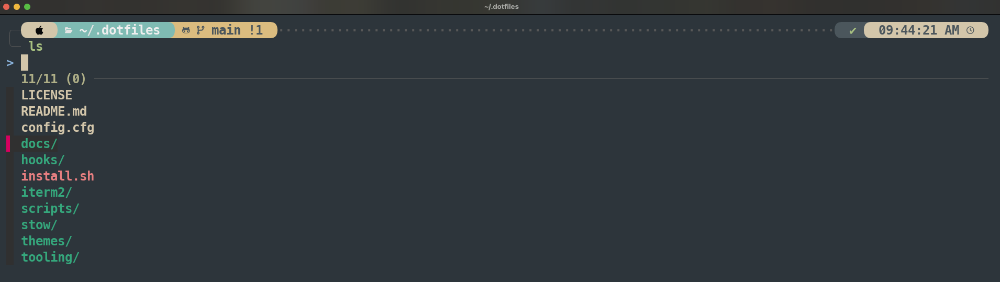

# 🌟 Daniel's Dotfiles



## ⚠️ Important!

🚀 Feel free to use my dotfiles, but **make sure to fork the repository** and review any changes before running them on your system!

⚠️ **Use at your own risk!**

---

## 📦 Installation

1️⃣ First, check out the `config.cfg` file. All variables are prefixed with the script name that uses them.

👉 For example:
If you want to run the `git.sh` script inside `/scripts`, make sure to set the `GIT_*` variables to match your Git account and repositories.

2️⃣ Some scripts require specific packages and tools, which are installed by my custom scripts.
   - All installed **packages** and **VS Code extensions** are tracked in the `./tools` directory:
     - 📜 `brew-formula.txt` → Homebrew formulas
     - 🍻 `brew-cask.txt` → Homebrew casks
     - 🧩 `vscode-extensions.txt` → VS Code extensions
   - These files are automatically updated via a **pre-commit hook**, keeping everything in sync with the installed packages and extensions.


3️⃣ To install **everything** in one go, just run:
```bash
   ./install.sh
```
⚡ This will execute all defined scripts.

4️⃣ If you don’t want to install everything, you can:

Run individual scripts manually:
```bash
./scripts/<name>.sh
```
Or edit install.sh and comment out the scripts you don’t want to run.
